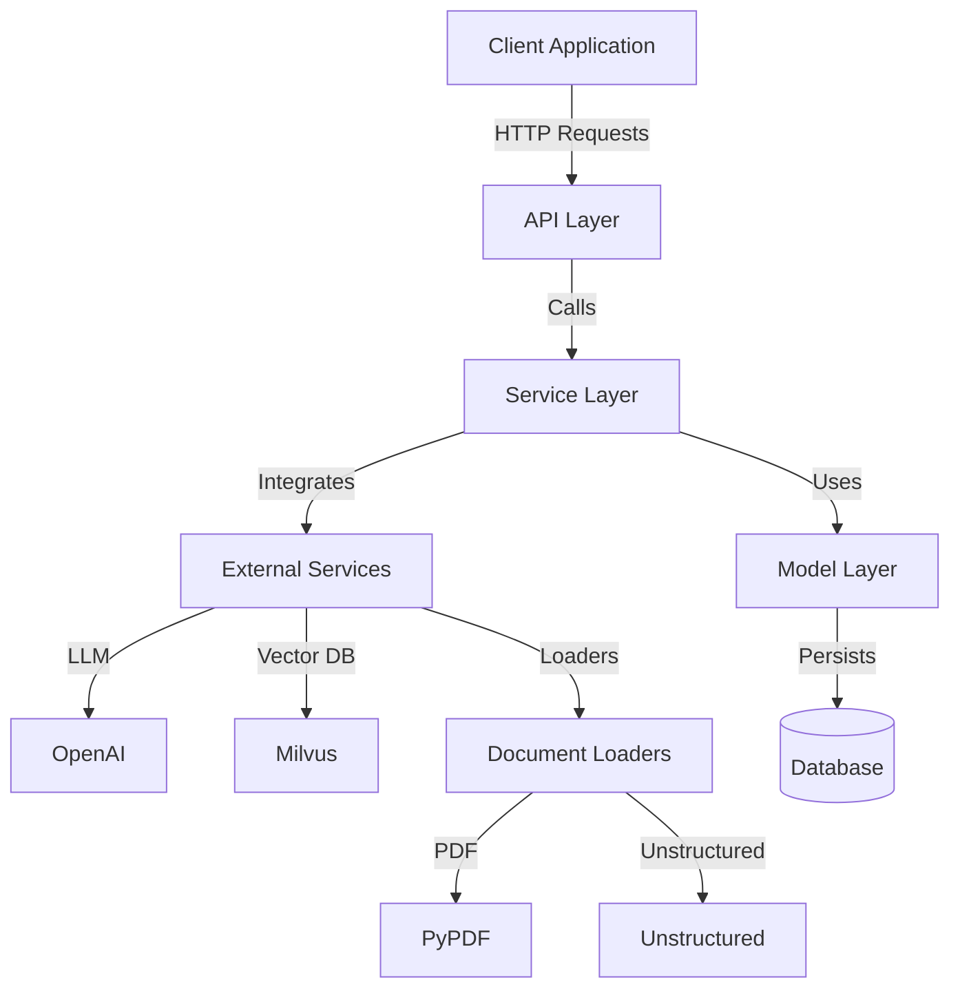

# Architecture Overview

This document provides a comprehensive overview of the Knowledge Table backend architecture, detailing its components, their interactions, and the overall system design.

## High-Level Architecture

Knowledge Table is built on a modular, service-oriented architecture that allows for flexibility and extensibility. The main components are:

1. API Layer
2. Service Layer
3. Model Layer
4. External Integrations (LLMs, Vector Databases, Document Loaders)



## Project Structure

```plaintext
backend/
├── src/
│   └── app/
│       ├── api/
│       │   └── v1/
│       │       └── endpoints/
│       │           ├── document.py
│       │           ├── graph.py
│       │           └── query.py
│       ├── core/
│       │   ├── config.py
│       │   └── dependencies.py
│       ├── models/
│       │   ├── document.py
│       │   ├── graph.py
│       │   ├── llm.py
│       │   └── query.py
│       ├── schemas/
│       │   ├── document.py
│       │   ├── graph.py
│       │   └── query.py
│       └── services/
│           ├── document_service.py
│           ├── graph_service.py
│           ├── llm_service.py
│           ├── query_service.py
│           ├── llm/
│           │   ├── base.py
│           │   ├── factory.py
│           │   └── openai_service.py
│           ├── loaders/
│           │   ├── base.py
│           │   ├── factory.py
│           │   ├── pypdf_service.py
│           │   └── unstructured_service.py
│           └── vector_db/
│               ├── base.py
│               ├── factory.py
│               └── milvus_service.py
├── tests/
└── docs/
```

## Component Details

### 1. API Layer (`app/api/`)

The API layer is built using FastAPI and defines the HTTP endpoints that clients interact with.

- **Endpoints**: 
  - `/documents/`: Handle document uploads and retrieval.
  - `/graphs/`: Manage knowledge graphs.
  - `/queries/`: Process natural language queries.

### 2. Service Layer (`app/services/`)

The service layer contains the core business logic of the application.

- **Document Service**: Handles document processing, storage, and retrieval.
- **Graph Service**: Manages the creation and querying of knowledge graphs.
- **LLM Service**: Interfaces with Language Models for text generation and analysis.
- **Query Service**: Processes natural language queries and returns structured results.

### 3. Model Layer (`app/models/`)

The model layer defines the data structures and database models used in the application.

- **Document**: Represents uploaded documents and their metadata.
- **Graph**: Defines the structure of knowledge graphs.
- **Query**: Represents user queries and their results.

### 4. External Integrations

- **LLM Integration** (`app/services/llm/`):
  - Abstracts interactions with Language Models.
  - Currently supports OpenAI, extensible to other providers.

- **Vector Database Integration** (`app/services/vector_db/`):
  - Manages vector embeddings for efficient similarity search.
  - Currently supports Milvus, extensible to other vector databases.

## Data Flow

1. **Document Upload**:
   ```mermaid
   sequenceDiagram
       Client->>API: Upload Document
       API->>DocumentService: Process Document
       DocumentService->>Loader: Load and Parse
       Loader->>LLMService: Generate Embeddings
       LLMService->>VectorDB: Store Embeddings
       DocumentService->>Database: Store Metadata
       API->>Client: Confirmation
   ```

2. **Query Processing**:
   ```mermaid
   sequenceDiagram
       Client->>API: Submit Query
       API->>QueryService: Process Query
       QueryService->>LLMService: Generate Query Embedding
       QueryService->>VectorDB: Similarity Search
       VectorDB->>QueryService: Relevant Documents
       QueryService->>LLMService: Generate Response
       API->>Client: Structured Response
   ```

## Key Design Principles

1. **Modularity**: Components are designed to be loosely coupled, allowing for easy replacement or extension.
2. **Extensibility**: The use of abstract base classes and factories allows for easy addition of new services (e.g., new LLM providers).
3. **Scalability**: The architecture supports horizontal scaling of services and the use of distributed databases.
4. **Security**: API authentication and data encryption are implemented at various levels.

## Configuration and Environment

- Configuration is managed through environment variables and the `app/core/config.py` file.
- Sensitive information (API keys, database credentials) is stored in environment variables.

## Testing Strategy

- Unit tests for individual components.
- Integration tests for service interactions.
- End-to-end tests for API endpoints.

## Deployment

- The application is containerized using Docker for consistent deployment across environments.
- Kubernetes can be used for orchestration in production environments.

## Future Considerations

- Implementation of caching mechanisms for improved performance.
- Addition of real-time processing capabilities.
- Integration with more LLM providers and vector databases.

This architecture provides a solid foundation for the Knowledge Table backend, allowing for efficient data processing, flexible integrations, and scalable operations.