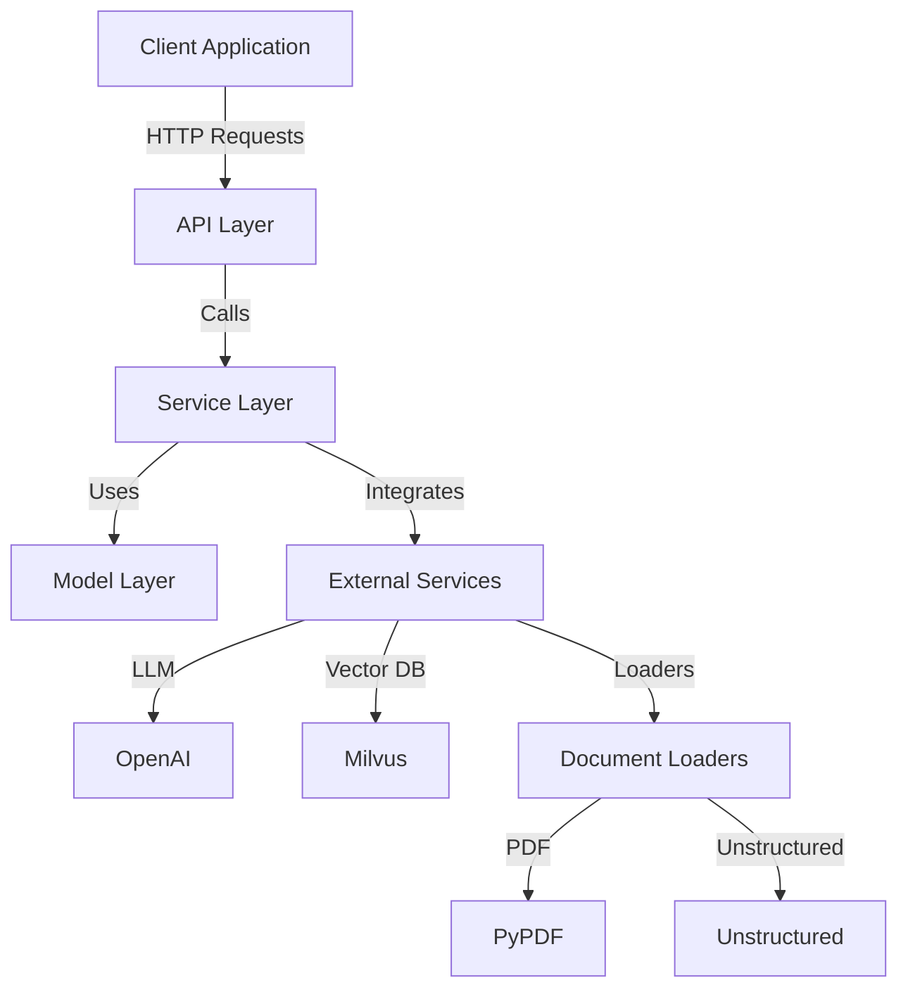
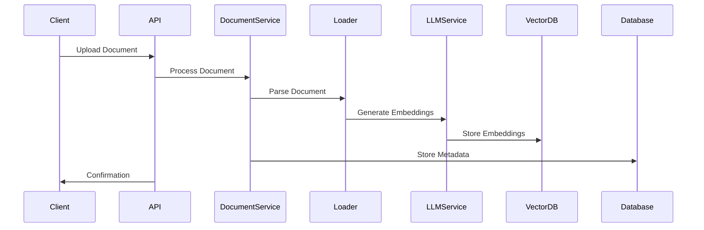
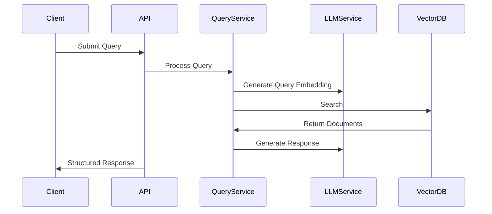

# Architecture Overview

This section provides an overview of the Knowledge Table backend architecture, covering key components and their interactions. Knowledge Table follows a modular, service-oriented architecture.



## Components

**API Layer**

_Handles HTTP requests from clients using FastAPI_

- **`/documents/`**: Document upload and retrieval.
- **`/graphs/`**: Knowledge graph management.
- **`/queries/`**: Natural language query processing.

**Service Layer**

_Contains core business logic_

- **Document Service**: Manages document processing and storage.
- **Graph Service**: Handles knowledge graph creation and querying.
- **LLM Service**: Interfaces with language models for text analysis.
- **Query Service**: Processes queries and returns structured responses.

**Model Layer**

_Defines database models for documents, graphs, and queries_

**External Integrations**

_Connects to Language Models (LLMs), vector databases, and document loaders_

- **LLM**: Supports OpenAI and is extensible to other providers.
- **Vector Database**: Manages embeddings for similarity search using Milvus.
- **Document Loaders**: Processes PDFs and unstructured documents.

## Project Structure

```plaintext
backend/
├── src/
│   └── app/
│       ├── api/
│       │   └── v1/
│       │       └── endpoints/
│       │           ├── document.py
│       │           ├── graph.py
│       │           └── query.py
│       ├── core/
│       │   ├── config.py
│       │   └── dependencies.py
│       ├── models/
│       │   ├── document.py
│       │   ├── graph.py
│       │   ├── llm.py
│       │   └── query.py
│       ├── schemas/
│       │   ├── document.py
│       │   ├── graph.py
│       │   └── query.py
│       └── services/
│           ├── document_service.py
│           ├── graph_service.py
│           ├── llm_service.py
│           ├── query_service.py
│           ├── llm/
│           │   ├── base.py
│           │   ├── factory.py
│           │   |── openai_service.py
│           │   └── prompts.py
│           ├── loaders/
│           │   ├── base.py
│           │   ├── factory.py
│           │   ├── pypdf_service.py
│           │   └── unstructured_service.py
│           └── vector_db/
│               ├── base.py
│               ├── factory.py
│               └── milvus_service.py
├── tests/
└── docs/
```

## Data Flow

### Document Upload



### Query Processing


