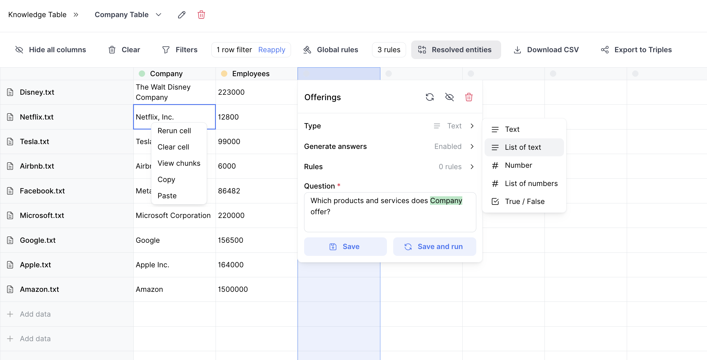

# Knowledge Table

Knowledge Table is an open-source package designed to simplify extracting and exploring structured data from unstructured documents. This site provides all the information you need to understand, use, and extend Knowledge Table.

**Follow the [Installation Guide](getting-started/installation.md) to get started.**

## Features

- **Extract with natural language** - Use natural language queries to extract structured data from unstructured documents.
- **Chunk Linking** - Link raw source text chunks to the answers for traceability and provenance.
- **Customizable extraction rules** - Define rules to guide the extraction process and ensure data quality.
- **Custom formatting** - Control the output format of your extracted data. Knowledge table current supports text, list of text, number, list of numbers, and boolean formats.
- **Filtering** - Filter documents based on metadata or extracted data.
- **Exporting as CSV or Triples** - Download extracted data as CSV or graph triples.
- **Chained extraction** - Reference previous columns in your extraction questions using '@' i.e. "What are the treatments for @disease?".
- **Split Cell Into Rows** - Turn outputs within a single cell from List of Numbers or List of Values and split it into individual rows to do more complex Chained Extraction

## Concepts

### Tables

Like a spreadsheet, a **table** is a collection of rows and columns that store structured data. Each row represents a **document**, and each column represents an **entity** that is extracted and formatted with a **question**.

### Documents

Each **document** is an unstructured data source (e.g., a contract, article, or report) uploaded to the Knowledge Table. When you upload a document, it is split into chunks, the chunks are embedded and tagged with metadata, and stored in a vector database.

### Question

A **Question** is the core mechanism for guiding extraction. It defines what data you want to extract from a document.

### Rule

A **Rule** guides the extraction from the LLM. You can add rules on a column level or on a global level. Currently, the following rule types are supported:

- **May Return** rules give the LLM examples of answers that can be used to guide the extraction. This is a great way to give more guidance for the LLM on the type of things it should keep an eye out for.
- **Must Return** rules give the LLM an exhaustive list of answers that are allowed to be returned. This is a great way to give guardrails for the LLM to ensure only certain terms are returned.
- **Allowed # of Responses** rules are useful for provide guardrails in the event there are may be a range of potential ‘grey-area’ answers and we want to only restrict and guarantee only a certain number of the top responses are provided.
- **Resolve Entity** rules allow you to resolve values to a specific entity. This is useful for ensuring output conforms to a specific entity type. For example, you can write rules that ensure "blackrock", "Blackrock, Inc.", and "Blackrock Corporation" all resolve to the same entity - "Blackrock".

## APIs

- [Document API](api/v1/endpoints/document.md)
- [Graph API](api/v1/endpoints/graph.md)
- [Query API](api/v1/endpoints/query.md)

## Services

- [Document Service](services/document_service.md)
- [Graph Service](services/graph_service.md)
- [Query Service](services/query_service.md)
- [LLM Service](services/llm_service.md)

## Extending the Backend

[Click here](extending/overview.md) to learn more about extending the backend.

## Testing

[Click here](testing/testing.md) to learn more about testing.

## Contributing

We welcome contributions! Please see our [Contributing Guide](CONTRIBUTING.md) for more information on how to get involved.

## Support

For support, join our [Discord community](https://discord.gg/PAgGMxfhKd) or contact us at team@whyhow.ai.
