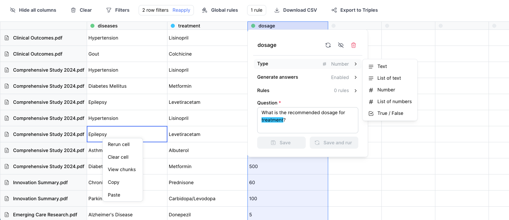

# Knowledge Table Documentation

Knowledge Table is an open-source package designed to simplify extracting and exploring structured data from unstructured documents. This site provides all the information you need to understand, use, and extend Knowledge Table.

## Features

- Extract structured data using natural language queries
- Build custom extraction rules and formatting
- Link chunks to answers for traceability and provenance
- Explore and filter data using extracted data
- Export data as CSV or graph triples
- Chain extraction and answer generation by referencing other cells
- Extend to include new AI services, vector databases, and LLMs
- And much more...

## Table of Contents

- [Getting Started](getting-started/quickstart.md)

To get started with the Knowledge Table backend:

1. [Installation Guide](getting-started/installation.md)
2. [Configuration](getting-started/configuration.md)

## Extending the Backend

Learn how to extend the backend:

- [Document Loaders](extending/document_loaders.md)
- [Integrating New LLMs](extending/llm_services.md)
- [Custom Vector Databases](extending/vector_databases.md)

## API Reference

For detailed API documentation, refer to the [API Reference](api/overview.md) section.

## Contributing

We welcome contributions! Please see our [Contributing Guide](CONTRIBUTING.md) for more information on how to get involved.

## Support

For support, join our [Discord community](https://discord.gg/PAgGMxfhKd) or contact us at team@whyhow.ai.
