# Tutorial

This brief tutorial offers a brief walkthrough of Knowledge Table features.

## Upload Documents

You can drag and drop `.pdf` and `.txt` files into the Knowledge Table using the frontend. In this case, we'll upload various simple txt files containing information about different public companies. When you upload them, they are automatically chunked and made available for querying.

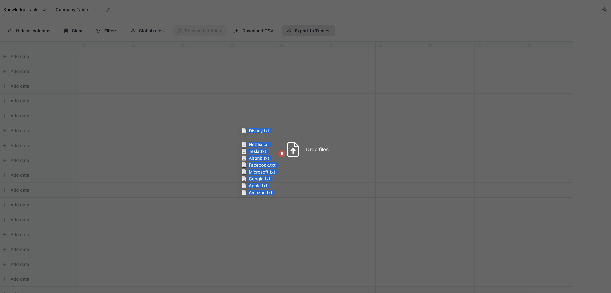

## Configure column

Next, we'll configure a column to extract our first piece of data. We'll create a column called "Company" and we'll wrtie a prompt to extract the name of the company mentioned in each document. The column type is set to "text," and answer generation is enabled, instructing Knowledge Table to pull relevant information based on the prompt and format it as a string. Once done, we'll hit 'Save' to save the column.

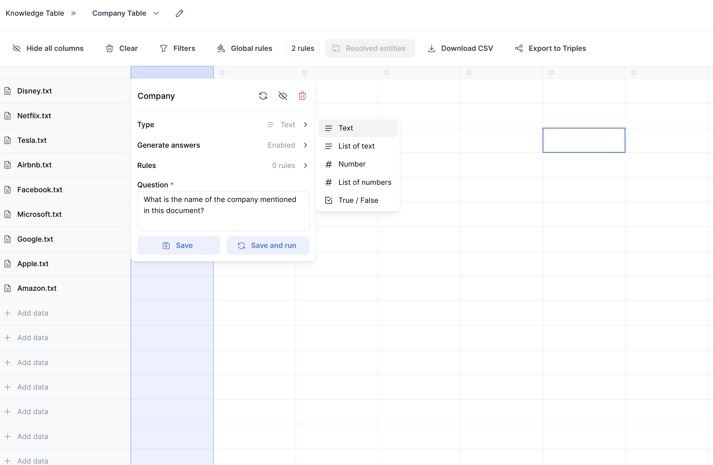

## Resolve Entities

Before we run the column, we're going to add a few entity resolution rules to ensure that company names are resolved to the name we expect. To do this, we'll add a few global rules indicating that names like "Apple Inc." or "Google LLC" should be resolved to "Apple" and "Google."

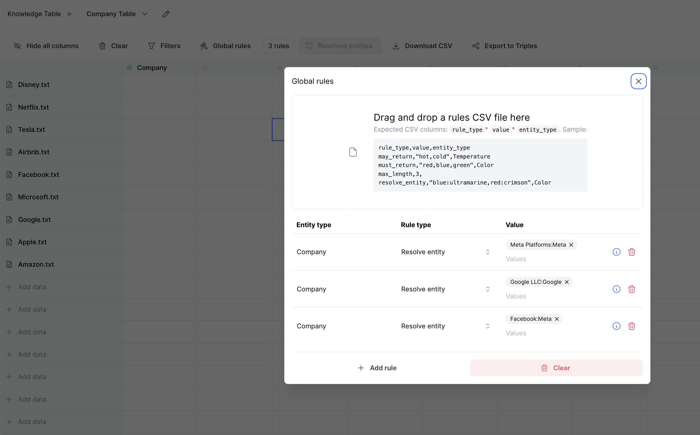

## Run & Rerun Columns, Rows, and Cells

Once the rules are set, we can run the column by right-clicking on the column header and selecting 'Rerun Column.' When you run a column, Knowledge Table will run the prompt for each row.

You can also run by row by right-clicking the document and selecting 'Rerun row.' Or you can run an individual cell by right-clicking the cell and selecting 'Rerun cell.'

**Rerun**
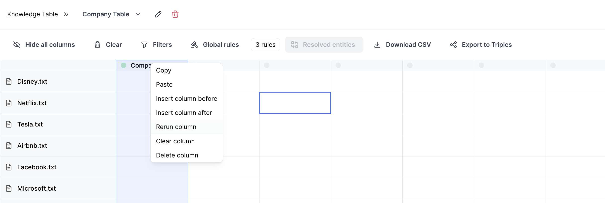

**In Progress**
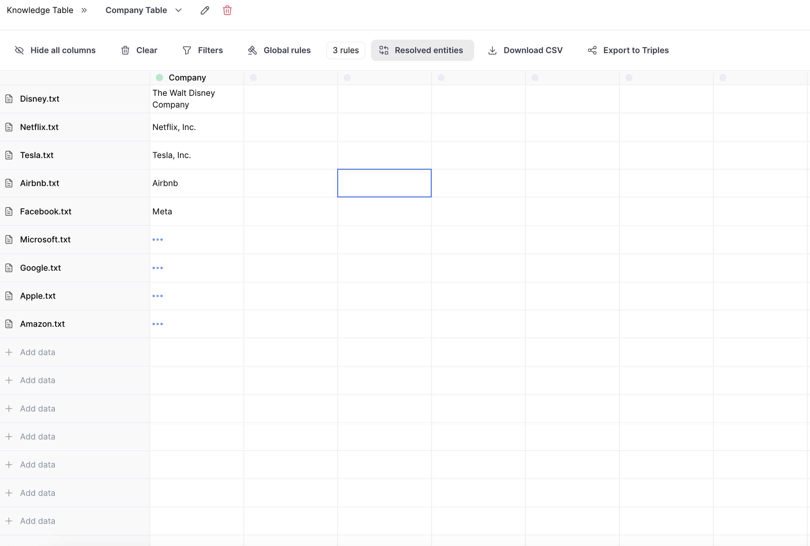

**Result**
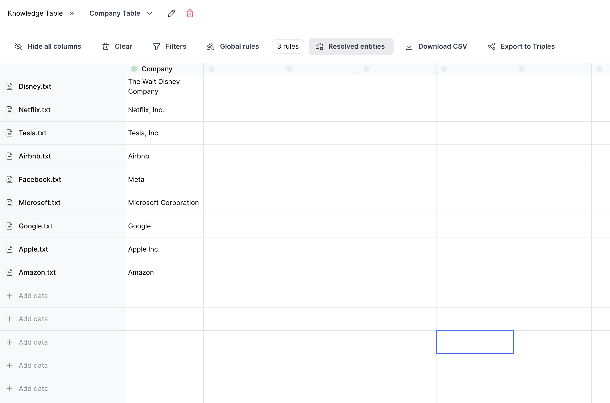

As we can see, the company names have been extracted from the documents and the names have been resolved according to the rules we set. If you would like to see the entities that have been resolved, click 'Resolved Entities' and a drawer will appear showing the resolved entities.

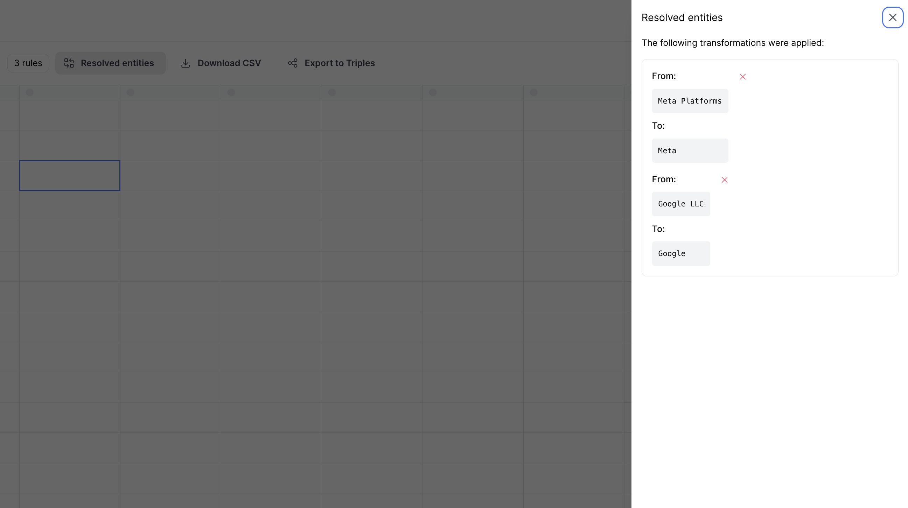

To undo the entity resolution, just click the red 'x' next to the resolved entity, and the answer will revert to the original text.

## View Chunks

You can view the chunks from which answers have been extracted by right-clicking on a cell and selecting 'View Chunks.' This will display the relevant chunks that are related to the answer which was generated.

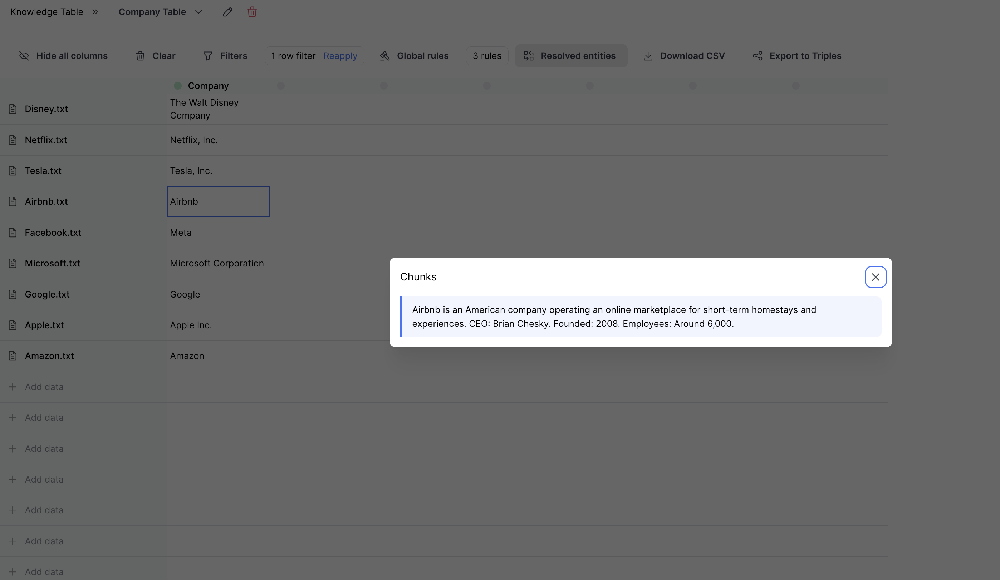

## Chain Extraction

You can chain extraction by creating a new column and writing a prompt that references another column. In this case, we'll create a new column called "Employees" and make it type "number" and write a prompt that references the "Company" column by using '@'. This will automatically load the answer from the "Company" column into the prompt.

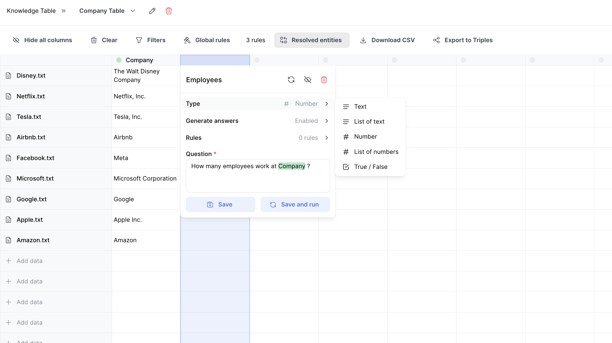

Then, we're going to add one more column called "Offerings" and write a prompt that references the "Company" column. This time, we'll use the "Company" column to extract the products and services offered by each company. For this column, we'll specify List of Text as the column type, this way our output will be a list of strings extracted from the document.

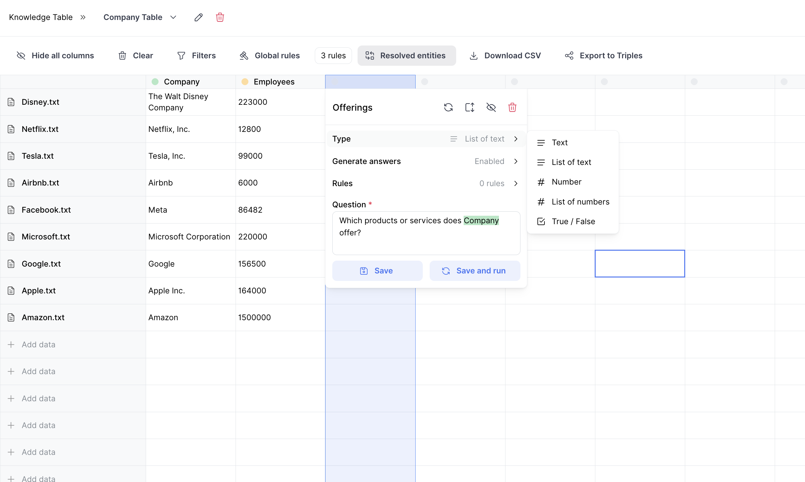

## Filter

Let's say we want to see the companies that offer consumer electronics products. We can add filter on the "Offerings" column and specify on the column header and selecting "Filter." We can then write a prompt to filter the column by companies that offer consumer electronics products.

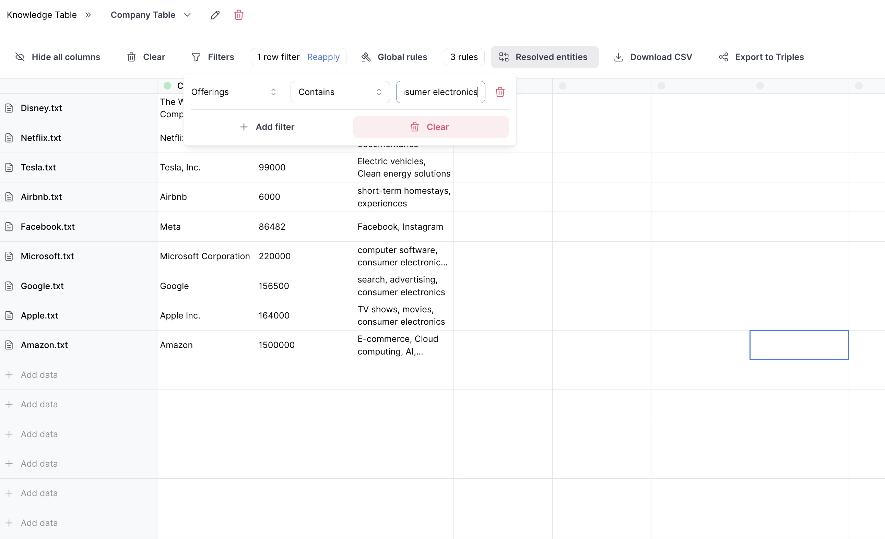

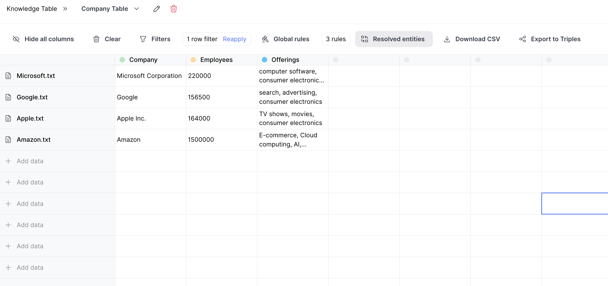

## Split cells into rows

We can split the answer into rows to perform further analysis on each individual product or service. To do this, we can right-click the cell and select "Split into rows." This will split each of the cells into multiple rows, each containing a single product or service.

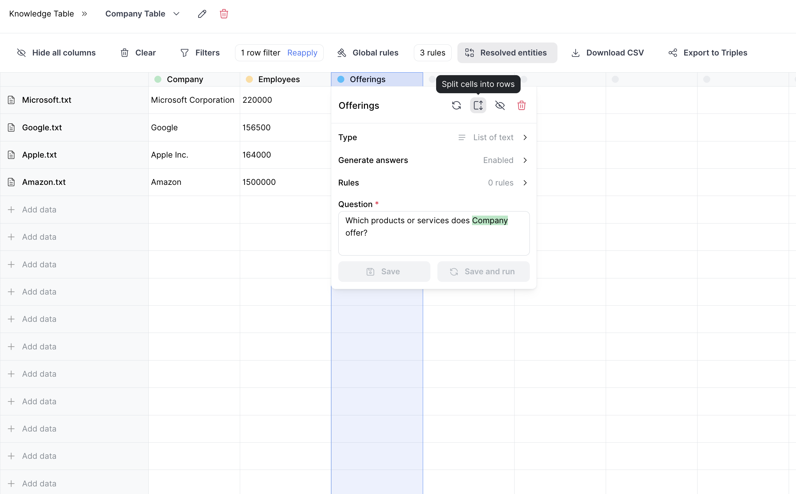

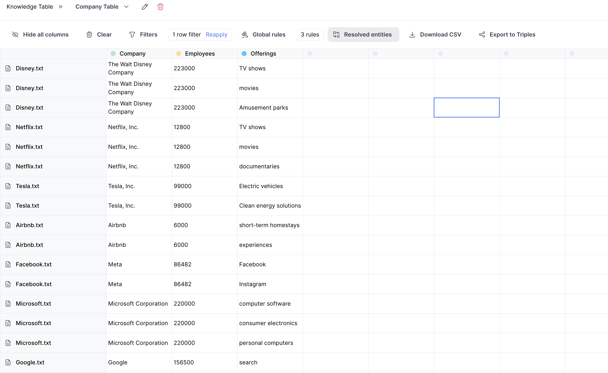

Now, we can perform additional extraction and analysis on each disease by chaining extraction like we did before

## Export

Once we've extracted all the data we need, we can export the data in a couple different ways.

**Export CSV**

You can download the data as a CSV file by clicking "Download CSV" and you'll get a file that looks like this:

```
Document,Company,Employees,Offerings
"Disney.txt",The Walt Disney Company,223000,TV shows
"Disney.txt",The Walt Disney Company,223000,movies
"Disney.txt",The Walt Disney Company,223000,Amusement parks
"Netflix.txt",Netflix, Inc.,12800,TV shows
"Netflix.txt",Netflix, Inc.,12800,movies
"Netflix.txt",Netflix, Inc.,12800,documentaries
"Tesla.txt",Tesla, Inc.,99000,Electric vehicles
```

**Export Triples**

You can also export the data in triples format by clicking "Download Triples." When you do, the table data will be sent to the backend where a schema will be generated, triples will be built according to that schema, and chunks will be linked to each triple accordingly. The output will look somthing like this:

```json
{
   "triples": [
      {
      "triple_id": "t6ecedb7b-ef77-4b86-8e0d-37d928f1d475",
         "head": {
         "label": "Company",
         "name": "The Walt Disney Company",
         "properties": { "document": "Disney.txt" }
         },
      "tail": {
         "label": "Offerings",
         "name": "TV shows",
         "properties": { "document": "Disney.txt" }
      },
      "relation": { "name": "Offers" },
      "chunk_ids": []
      },
      ...],
   "chunks": [...]
}
```

You can use these triples to [build a knowledge graph](https://whyhow-ai.github.io/whyhow-sdk-docs/examples/create_graph_from_knowledge_table/) using the WhyHow SDK.
