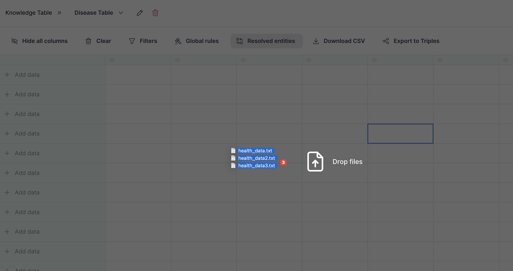
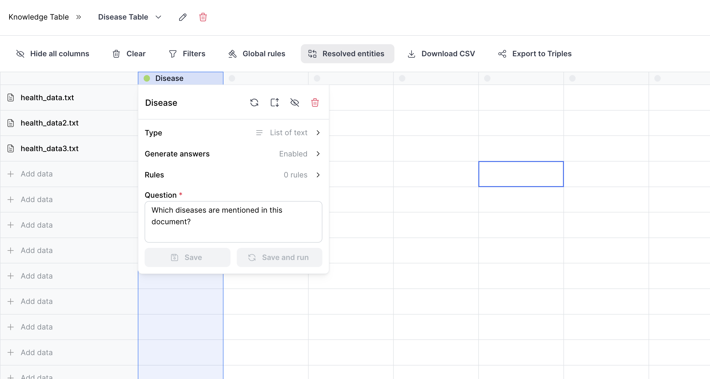
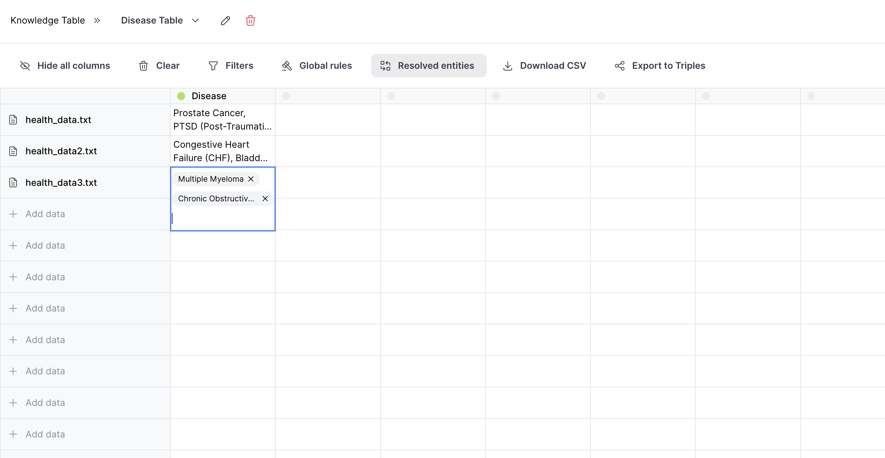
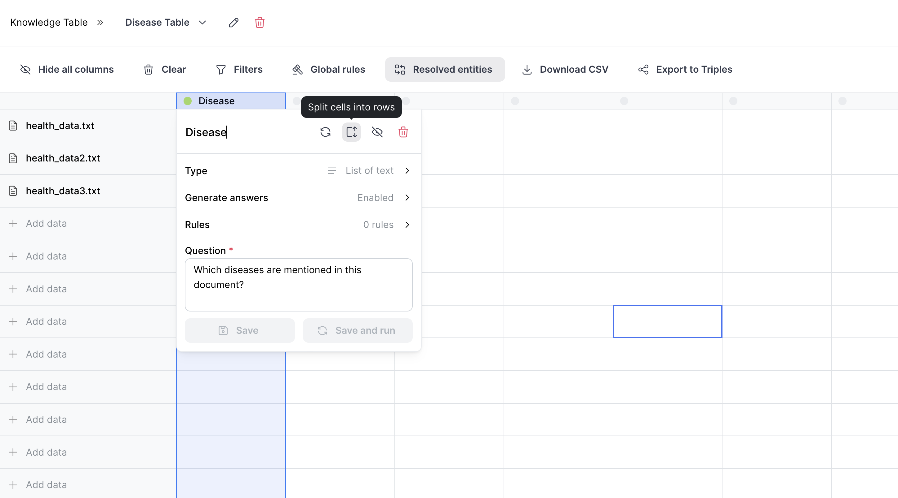
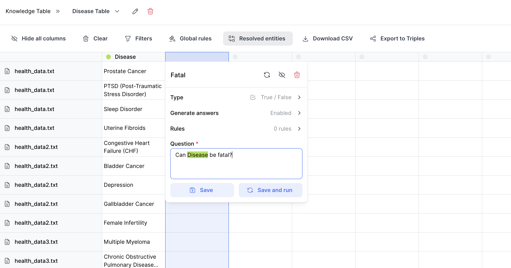
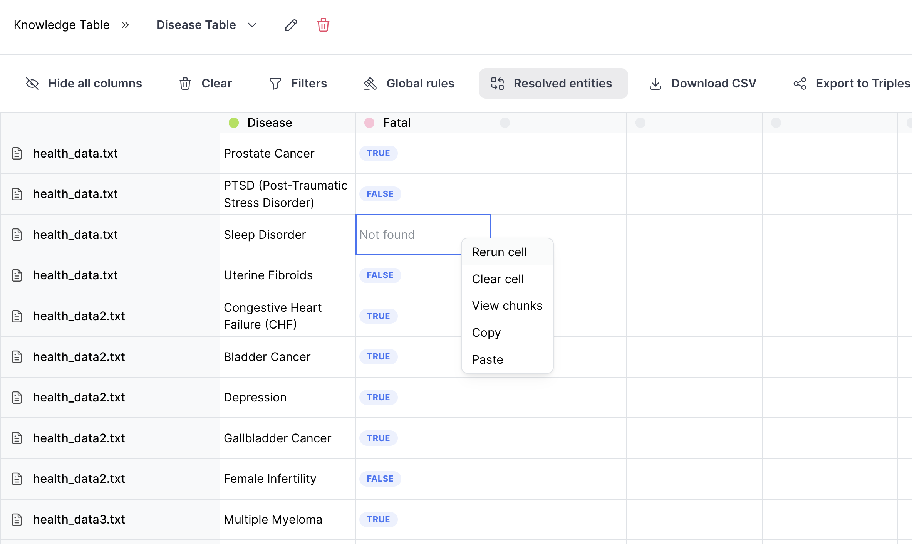

# Tutorial

This brief tutorial walks you through getting started extracting data and chaining responses using Knowledge Table.

## Upload Documents

You can drag and drop `.pdf` and `.txt` files into the Knowledge Table using the frontend. In this case, we'll upload three simple txt files which discuss various different diseases, their side effects, and their treatments. When you upload them, they are automatically chunked and made available for querying.



## Configure column

Next, we'll configure a column to extract our first piece of data. We'll create a column called "Disease" and we'll wrtie a prompt to extract the diseases mentioned in each document. The column type is set to "List of text," and answer generation is enabled, instructing Knowledge Table to pull relevant information based on the prompt and format it as a list of text. You can also add in rules to constrain the data extracted. Once we save and run the column, queries are run and the extraction begins.

**Configuration**


**Result**


## Split cells into rows

We can then split the answer into rows to perform further analysis on each individual disease. This is done by selecting the cell and clicking "Split cell into rows."



## Chain extraction

Now, we can perform additional extraction and analysis on each disease by chaining extraction. We'll create a new column called "Fatal" and write a prompt to determine whether a given disease can be fatal. By mentioning another column using '@', we can automatically load that column's answer into the prompt and inject it into the prompt.



## Rerun cells

Sometimes, an answer is not found. To try again, we can just right click the cell (or an entire row or column) and select "Rerun cell." This will re-run the extraction process and update the answer.


## Export as CSV

1. **Upload a Document**

   Use the `/documents/` endpoint to upload a document.

   ```bash
   curl -X POST "http://localhost:8000/api/v1/documents/" \
   -H "accept: application/json" \
   -H "Content-Type: multipart/form-data" \
   -F "file=@/path/to/your/document.pdf"
   ```

2. **Define an Extraction Query**

   Use the `/queries/` endpoint to create a query.

   ```json
   {
     "question": "What is the main topic of the document?"
   }
   ```

3. **Retrieve the Answer**

   Use the `/queries/{id}/results/` endpoint to get the extracted data.

## Conclusion

You've successfully extracted data from a document. Explore other functionalities to get the most out of Knowledge Table.
